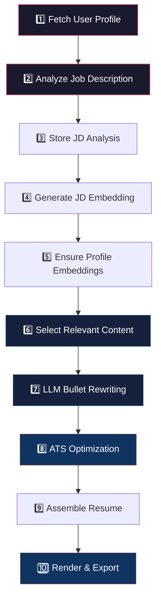
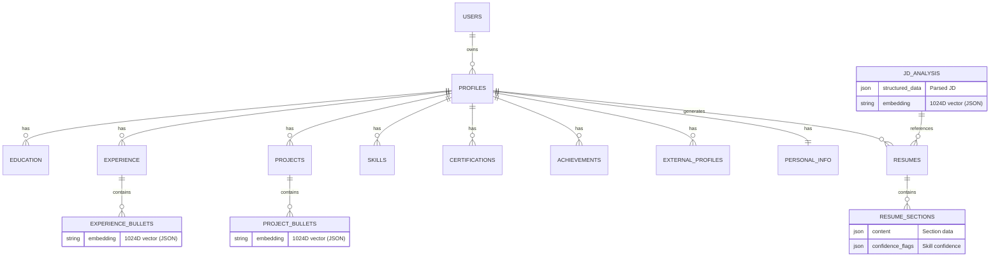

<p align="center">
  <h1 align="center">📄 OneResume</h1>
  <p align="center">
    <strong>AI-Powered Role-Specific Resume Generation Platform</strong>
  </p>
  <p align="center">
    Maintain one profile. Generate infinite, tailored, ATS-optimized resumes — powered by Generative AI.
  </p>
</p>

<p align="center">
  
  
  
  
  
  
  
</p>

---

## 🧠 Problem Statement

Job applicants must tailor their resumes for *every* role to maximize relevance and **ATS (Applicant Tracking System)** compatibility. This process is time-consuming, repetitive, and error-prone — especially when applicants already have a rich professional background.

**OneResume** solves this by maintaining a **single, structured user profile** and automatically generating **role-specific, ATS-optimized resumes** from any Job Description (JD) — no manual rebuilding required.

---

## ✨ Key Features

| Feature | Description |
|---|---|
| 🧑‍💼 **Centralized Profile** | Store all your professional data once — education, experience, projects, skills, certifications, achievements, and external profiles |
| 📋 **Intelligent JD Analysis** | Paste any job description and let Gemini extract structured data: role title, required skills, keywords, experience level, and role category |
| 🔗 **Semantic Matching** | 1024-dimensional multilingual embeddings power cosine-similarity scoring to match your profile against each JD |
| 🏆 **Composite Relevance Scoring** | Multi-factor scoring engine weighing semantic similarity, skill importance, section priority, recency, and ATS keyword overlap |
| ✍️ **LLM-Powered Rewriting** | Gemini rewrites your resume bullets to be concise, impactful, and ATS-friendly — without fabricating any skills or experience |
| 📊 **ATS Optimization Engine** | Rule-based engine enforces keyword coverage, section ordering, bullet limits, and formatting constraints |
| 📥 **Multi-Format Export** | Download your resume as **PDF** (via LaTeX) or **DOCX** — professionally formatted and ready to submit |
| 🔄 **Resume Versioning** | Every generated resume is stored with version metadata, enabling comparison and rollback |
| 🛡️ **Skill Confidence Tracking** | Transparent confidence flags (strong / inferred / weak) for every must-have skill — the system never hallucinates |

---

## 🏗️ Architecture Overview

```
┌─────────────────────────────────────────────────────────────────────────┐
│                        FRONTEND (Next.js 16 + React 19)                │
│   ┌──────────┐  ┌────────────┐  ┌──────────────┐  ┌────────────────┐  │
│   │ Homepage │  │  Dashboard │  │  Profile Mgmt│  │  Resume View   │  │
│   └────┬─────┘  └─────┬──────┘  └──────┬───────┘  └───────┬────────┘  │
│        └──────────────┼────────────────┼───────────────────┘           │
│                       │           REST API                            │
└───────────────────────┼───────────────────────────────────────────────┘
                        │
┌───────────────────────┼───────────────────────────────────────────────┐
│                  BACKEND (FastAPI + Python 3.10+)                     │
│                       │                                               │
│   ┌───────────────────▼────────────────────────────────────────────┐  │
│   │                    ORCHESTRATOR SERVICE                        │  │
│   │  Coordinates the end-to-end resume generation pipeline         │  │
│   └───┬────────┬─────────┬──────────┬──────────┬──────────┬───────┘  │
│       │        │         │          │          │          │           │
│   ┌───▼──┐ ┌──▼───┐ ┌───▼───┐ ┌───▼───┐ ┌───▼───┐ ┌───▼────┐     │
│   │  JD  │ │Embed │ │Score  │ │Relev. │ │ LLM   │ │  ATS   │     │
│   │Anlyzr│ │ Svc  │ │Engine │ │Select.│ │ Svc   │ │Optimzr │     │
│   └──────┘ └──────┘ └───────┘ └───────┘ └───────┘ └────────┘     │
│       │        │         │          │          │          │           │
│   ┌───▼────────▼─────────▼──────────▼──────────▼──────────▼───────┐  │
│   │  Resume Assembler → LaTeX Renderer → Export Service (PDF/DOCX)│  │
│   └──────────────────────────────────────────────────────────────┘   │
│                                                                       │
│   ┌──────────────────────────────────┐                                │
│   │    SQLite (SQLAlchemy ORM)       │                                │
│   │  Users │ Profiles │ JD Analysis  │                                │
│   │  Resumes │ Resume Sections       │                                │
│   └──────────────────────────────────┘                                │
└───────────────────────────────────────────────────────────────────────┘
                        │                          │
              ┌─────────▼────────┐       ┌─────────▼────────┐
              │  Google Gemini   │       │  Pinecone Embed  │
              │  (gemini-3-flash │       │  (multilingual-  │
              │   -preview)      │       │   e5-large)      │
              └──────────────────┘       └──────────────────┘
```

---

## 🔬 GenAI Technology Deep Dive

OneResume leverages two distinct generative AI services, each with a clearly defined responsibility boundary — ensuring **no AI overreach** and **full explainability**.

### 1. Google Gemini (`gemini-3-flash-preview`)

Gemini is used in two tightly scoped roles:

| Use Case | Service | Responsibility |
|---|---|---|
| **JD Analysis** | `jd_analyzer.py` | Extracts structured data from raw job descriptions — role title, experience level, must-have skills, nice-to-have skills, ATS keywords, and role category. Output follows a strict JSON schema. |
| **Bullet Rewriting** | `llm_service.py` | Rewrites selected resume bullet points to be concise, impact-driven, and ATS-friendly. **Strictly forbidden** from fabricating skills, adding unverified information, or making structural changes. |

**Key Design Principles:**
- The LLM acts as a **rewriter**, never a **decision-maker**
- All prompts are governed by **strict prompt contracts** to prevent hallucination
- Both services include **rule-based fallbacks** that activate when the Gemini API key is unavailable or the API call fails
- JSON responses are sanitized to strip markdown code fences that Gemini occasionally wraps around output

### 2. Pinecone Inference API (`multilingual-e5-large`)

| Aspect | Detail |
|---|---|
| **Model** | `multilingual-e5-large` — a state-of-the-art multilingual embedding model |
| **Dimensions** | 1024-dimensional dense vectors |
| **Hosted On** | Pinecone Inference API (cloud-hosted, no local GPU required) |
| **Input Type** | `passage` type with `END` truncation |
| **Batch Support** | Yes — bulk embedding generation for efficiency |

**Embedding Strategy:**
- **Bullet-level embeddings** — each experience/project bullet is individually embedded for fine-grained matching
- **Section-level embeddings** — average of constituent bullet embeddings for fast section ranking
- **JD embeddings** — composite text (`role_title + must_have_skills + keywords`) embedded for comparison
- Embeddings are **stored alongside relational data** and reused unless content changes — minimizing redundant API calls

### 3. Composite Scoring Engine

The scoring engine combines multiple signals into a single relevance score:

```
final_score = semantic_similarity
              × skill_importance_weight    (1.5× for must-have, 1.0× for nice-to-have)
              × section_priority_weight    (1.0× experience → 0.5× certification)
              × recency_weight             (1.0 for current, decays 0.05/year, min 0.6)
              + keyword_bonus              (0.05 per keyword match, capped at 0.3)
```

### 4. Must-Have Skill Handling (Graceful Degradation)

When a required skill is missing from the profile, OneResume uses a 3-tier confidence system:

| Tier | Strategy | Confidence |
|---|---|---|
| 1 | **Direct match** — exact or substring match in profile skills | `strong` |
| 2 | **Semantic inference** — skill mentioned in bullet text, or cosine similarity > 0.6 | `inferred` |
| 3 | **Fallback** — closest relevant content included without fabrication | `weak` |

> **Resume generation never fails** due to missing skills.

---

## 🛠️ Technology Stack

### Backend

| Technology | Version | Purpose |
|---|---|---|
| **Python** | ≥ 3.10 | Core language |
| **FastAPI** | ≥ 0.104 | Async REST API framework |
| **SQLAlchemy** | ≥ 2.0 | ORM with declarative models |
| **Pydantic** | ≥ 2.5 | Request/response validation & settings management |
| **Alembic** | ≥ 1.13 | Database migration toolkit |
| **SQLite** | — | Development database (PostgreSQL/pgvector ready) |
| **google-generativeai** | ≥ 0.3.0 | Google Gemini SDK |
| **pinecone** | ≥ 5.0.0 | Pinecone Inference API for embeddings |
| **NumPy** | ≥ 1.24 | Vector math and cosine similarity |
| **python-docx** | ≥ 1.1 | DOCX resume export |
| **Jinja2** | ≥ 3.1 | LaTeX template rendering |
| **passlib + bcrypt** | — | Password hashing and authentication |
| **Uvicorn** | ≥ 0.24 | ASGI server |

### Frontend

| Technology | Version | Purpose |
|---|---|---|
| **Next.js** | 16.1.6 | React meta-framework with App Router |
| **React** | 19.2.3 | UI library |
| **TypeScript** | ≥ 5 | Type-safe frontend development |
| **Lucide React** | ≥ 0.575 | Icon library |
| **CSS Modules** | — | Scoped, componentized styling |

### Testing

| Technology | Purpose |
|---|---|
| **pytest** | Test runner |
| **pytest-asyncio** | Async test support |
| **httpx** | Async HTTP client for API testing |
| **pytest-cov** | Code coverage |

---

## 📁 Project Structure

```
OneResume/
├── backend/
│   ├── app/
│   │   ├── main.py                    # FastAPI app entry point & router registration
│   │   ├── config.py                  # Pydantic settings (env vars, model configs)
│   │   ├── database.py                # SQLAlchemy engine, session factory, Base
│   │   ├── domain/
│   │   │   └── resume_draft.py        # Core domain objects (ResumeDraft, ScoredBullet, JDData)
│   │   ├── models/
│   │   │   ├── user.py                # User model (auth, ownership)
│   │   │   ├── profile.py             # Profile + all section models (experience, education, etc.)
│   │   │   ├── jd.py                  # JD analysis model
│   │   │   └── resume.py              # Resume + resume sections models
│   │   ├── repositories/              # Data access layer
│   │   ├── routers/
│   │   │   ├── users.py               # /api/users — registration, auth
│   │   │   ├── profiles.py            # /api/profiles — full profile CRUD
│   │   │   ├── jd.py                  # /api/jd — JD submission & analysis
│   │   │   └── resumes.py             # /api/resumes — resume generation & download
│   │   ├── schemas/                   # Pydantic request/response schemas
│   │   ├── services/
│   │   │   ├── orchestrator.py        # End-to-end pipeline controller
│   │   │   ├── jd_analyzer.py         # JD → structured data (Gemini + fallback)
│   │   │   ├── embedding_service.py   # Text → 1024D vectors (Pinecone)
│   │   │   ├── scoring_engine.py      # Composite relevance scoring
│   │   │   ├── relevance_selector.py  # Top-N section / Top-K bullet selection
│   │   │   ├── llm_service.py         # Bullet rewriting (Gemini + fallback)
│   │   │   ├── ats_optimizer.py       # Rule-based ATS optimization
│   │   │   ├── resume_assembler.py    # Final resume data assembly
│   │   │   ├── latex_renderer.py      # LaTeX → PDF rendering
│   │   │   └── export_service.py      # DOCX export (python-docx)
│   │   └── templates/                 # Jinja2 LaTeX templates
│   ├── tests/                         # Comprehensive test suite (10 test modules)
│   ├── output/                        # Generated resumes (PDF/DOCX)
│   └── pyproject.toml                 # Python project config & dependencies
│
├── frontend/
│   ├── src/
│   │   ├── app/
│   │   │   ├── page.tsx               # Landing page (auth flow)
│   │   │   ├── layout.tsx             # Root layout
│   │   │   ├── globals.css            # Global design system
│   │   │   └── dashboard/
│   │   │       ├── page.tsx           # Dashboard — resume overview
│   │   │       ├── layout.tsx         # Dashboard layout with sidebar
│   │   │       ├── profile/           # Profile management page
│   │   │       ├── analyze/           # JD analysis page
│   │   │       ├── generate/          # Resume generation page
│   │   │       └── resumes/           # Resume history & download
│   │   ├── components/
│   │   │   ├── Navbar.tsx             # Navigation bar
│   │   │   ├── GeometricCard.tsx      # Reusable card component
│   │   │   └── StatusCountdown.tsx    # Status indicator component
│   │   └── lib/                       # Shared utilities
│   ├── package.json
│   └── tsconfig.json
│
├── PRD.md                             # Product Requirements Document
├── databaseschema.md                  # Database schema design
└── feature to component Mapping.md    # Feature → component mapping
```

---

## 🔄 Resume Generation Pipeline

The orchestrator service (`orchestrator.py`) manages a deterministic, 10-step pipeline:



| Step | Service | What Happens |
|---|---|---|
| 1 | `ProfileRepository` | Fetches the user's complete profile from the database |
| 2 | `jd_analyzer.py` | Gemini extracts structured JD data (or rule-based fallback) |
| 3 | `JDAnalysisRepo` | Structured JD + raw text persisted to database |
| 4 | `embedding_service.py` | Composite JD text → 1024D embedding via Pinecone |
| 5 | `embedding_service.py` | All profile bullets without embeddings are embedded and stored |
| 6 | `relevance_selector.py` | Scores all sections/bullets, selects top-N/top-K, checks skill confidence |
| 7 | `llm_service.py` | Gemini rewrites selected bullets (with fallback to rule-based) |
| 8 | `ats_optimizer.py` | Enforces section limits, bullet limits, keyword coverage tracking |
| 9 | `resume_assembler.py` | Assembles final resume data structure |
| 10 | `latex_renderer.py` / `export_service.py` | Renders to PDF (LaTeX) and DOCX, stores resume record |

---

## 🚀 Getting Started

### Prerequisites

- **Python** ≥ 3.10
- **Node.js** ≥ 18
- **pdflatex** (optional, for PDF generation — install via `texlive-full` or equivalent)

### 1. Clone the Repository

```bash
git clone https://github.com/NayanshiSingh/OneResume.git
cd OneResume
```

### 2. Backend Setup

```bash
cd backend

# Create and activate virtual environment
python -m venv .venv
source .venv/bin/activate  # Windows: .venv\Scripts\activate

# Install dependencies
pip install -e ".[dev]"

# Configure environment variables
cp .env.example .env
# Edit .env with your API keys:
#   GEMINI_API_KEY=your-gemini-api-key
#   PINECONE_API_KEY=your-pinecone-api-key

# Start the backend server
uvicorn app.main:app --reload --port 8000
```

### 3. Frontend Setup

```bash
cd frontend

# Install dependencies
npm install

# Start the development server
npm run dev
```

The frontend will be available at `http://localhost:3000` and the API at `http://localhost:8000`.

### 4. API Documentation

With the backend running, visit:
- **Swagger UI**: [http://localhost:8000/docs](http://localhost:8000/docs)
- **ReDoc**: [http://localhost:8000/redoc](http://localhost:8000/redoc)

---

## 🧪 Running Tests

```bash
cd backend

# Run full test suite
pytest

# Run with coverage
pytest --cov=app --cov-report=term-missing

# Run specific test modules
pytest tests/test_scoring_engine.py
pytest tests/test_jd_analyzer.py
pytest tests/test_integration.py
```

**Test Suite Coverage:**

| Module | Tests |
|---|---|
| `test_profile_crud.py` | Full profile CRUD operations |
| `test_jd_analyzer.py` | JD analysis (Gemini + fallback) |
| `test_embedding_service.py` | Embedding generation & cosine similarity |
| `test_scoring_engine.py` | Composite scoring formula |
| `test_relevance_selector.py` | Content selection & skill confidence |
| `test_llm_service.py` | Bullet rewriting (Gemini + fallback) |
| `test_ats_optimizer.py` | ATS constraints & keyword coverage |
| `test_resume_assembler.py` | Resume data assembly |
| `test_integration.py` | End-to-end pipeline integration |
| `test_edge_cases.py` | Edge cases & error handling |

---

## 🌐 API Endpoints

| Method | Endpoint | Description |
|---|---|---|
| `POST` | `/api/users/register` | Register a new user |
| `POST` | `/api/users/login` | Authenticate user |
| `POST` | `/api/profiles/` | Create a user profile |
| `GET` | `/api/profiles/{id}` | Fetch profile with all sections |
| `PUT` | `/api/profiles/{id}` | Update profile sections |
| `POST` | `/api/jd/analyze` | Submit and analyze a job description |
| `POST` | `/api/resumes/generate` | Generate a tailored resume |
| `GET` | `/api/resumes/{id}` | Fetch resume details |
| `GET` | `/api/resumes/{id}/download` | Download resume file (PDF/DOCX) |
| `GET` | `/` | Health check |

---

## ⚙️ Configuration

All configuration is managed via environment variables (loaded from `.env`):

| Variable | Default | Description |
|---|---|---|
| `DATABASE_URL` | `sqlite:///oneresume.db` | Database connection string |
| `GEMINI_API_KEY` | — | Google Gemini API key |
| `GEMINI_MODEL` | `gemini-3-flash-preview` | Gemini model identifier |
| `PINECONE_API_KEY` | — | Pinecone API key for embeddings |
| `EMBEDDING_MODEL` | `multilingual-e5-large` | Embedding model name |
| `EMBEDDING_DIM` | `1024` | Embedding vector dimensions |
| `MAX_EXPERIENCE_SECTIONS` | `3` | Max experience sections in resume |
| `MAX_PROJECT_SECTIONS` | `3` | Max project sections in resume |
| `MAX_BULLETS_PER_SECTION` | `4` | Max bullets per section |
| `MAX_SKILLS` | `12` | Max skills listed in resume |
| `OUTPUT_DIR` | `./output` | Directory for generated files |

---

## 📐 Database Schema

The database uses a **relational + hybrid** design with embedding-ready vector storage:



---

## 🔮 Roadmap

- [ ] PostgreSQL + pgvector migration for production-grade vector search
- [ ] Multi-template LaTeX support (modern, classic, minimal)
- [ ] Resume performance analytics dashboard
- [ ] Public resume sharing links
- [ ] Multi-language resume generation
- [ ] Browser extension for one-click JD import
- [ ] CI/CD pipeline & cloud deployment (AWS/GCP)

---

## 📄 License

This project is built as a portfolio project by **Nayanshi Singh**.

---

<p align="center">
  <sub>Built with ❤️ using FastAPI, Next.js, Google Gemini, and Pinecone</sub>
</p>
